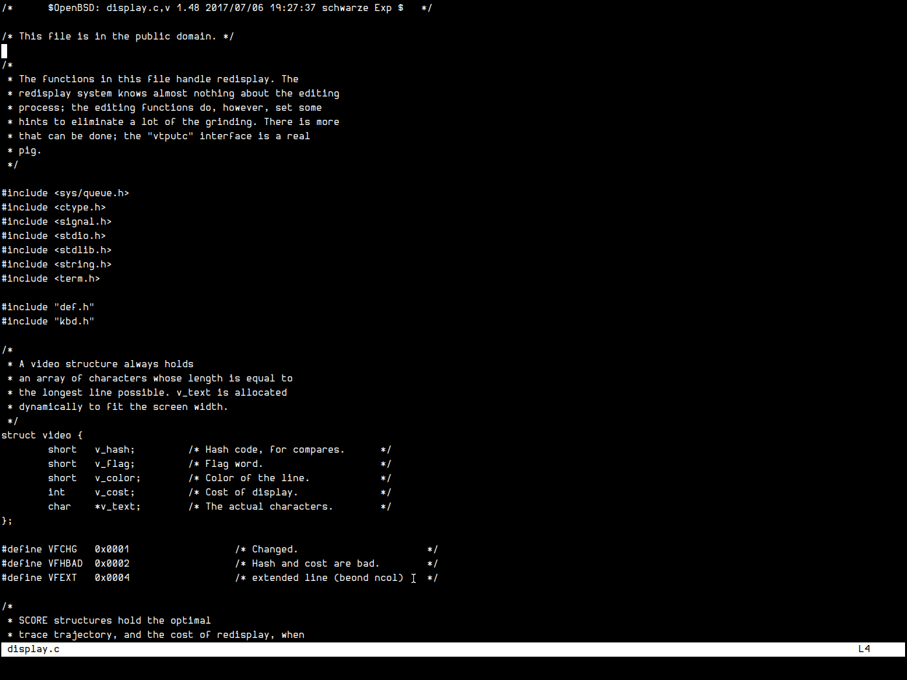

# Mg

This is my fork of the OpenBSD `mg` text editor. It's mainly for personal use and its pretty complete but feel free to suggest anything or open any issues if you feel it is neccessary

## Changes

- removed weird behaviour with brackets that I don't like

- Changed go to beginning of buffer to `C-x t` and go to bottom of buffer to `C-x b`

- added `M-o` to delete a line without overwriting the kill ring

- `M-d` and `M-<backspace>` no longer over write the kill ring

- Redesigned Modeline to be much cleaner

